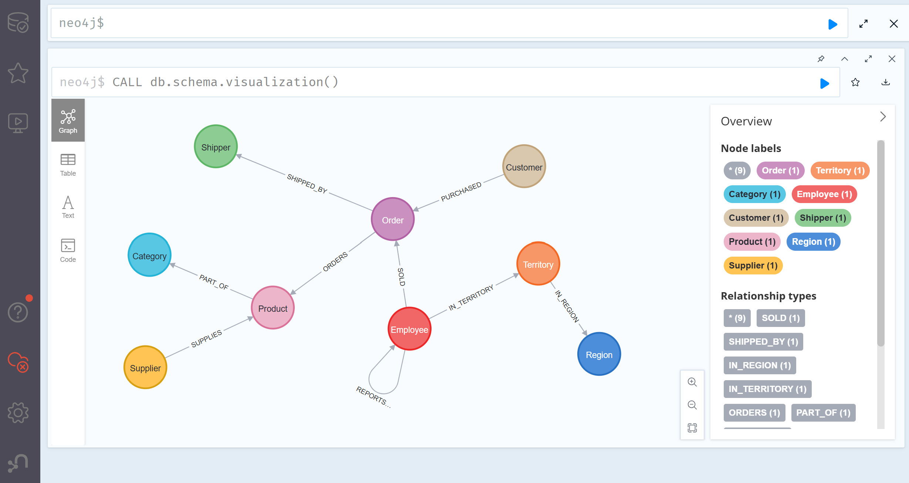
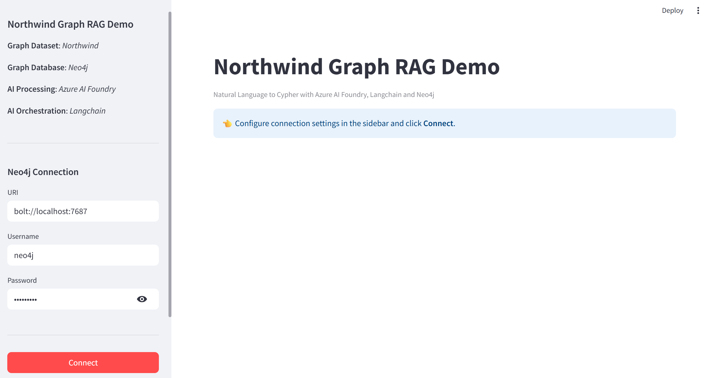
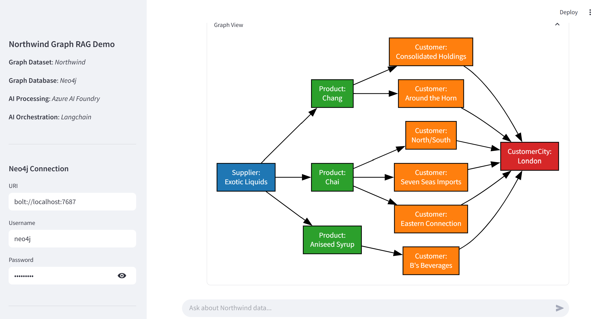

# Northwind: Graph RAG with Azure AI Foundry and Neo4j

This repo demonstrates how to deploy a **Neo4j** graph database pre-loaded with the _Northwind_ dataset and use it as a knowledge base for Graph RAG (Retrieval-Augmented Generation) workflows.

The solution includes a containerised **Neo4j** backend and a **Streamlit** frontend powered by **Azure AI Foundry** and **Langchain**.

> [!NOTE]
> This project utilises the _Northwind_ dataset, kindly shared by _Martin O'Hanlon_ and the _Neo4j_ team on this [repository](https://github.com/neo4j-graph-examples/northwind). All CSV data files used in the graph import are derived directly from this original work.

## 📑 Table of Contents:
- [Part 1: Environment & Authentication](#part-1-environment--authentication)
- [Part 2: Backend - Neo4j DB Deployment](#part-2-backend---neo4j-db-deployment)
- [Part 3: Frontend - Streamlit App Deployment](#part-3-frontend---streamlit-app-deployment)
- [Part 4: Graph RAG Sample](#part-4-graph-rag-sample)

## Part 1: Environment & Authentication

### 1.1. Prerequisites
The solution uses Microsoft **Entra ID** authentication via the `azure-identity` package. Please, ensure that you:

- logged in using `az login` command to retrieve Entra ID tokens,
- have relevant RBAC (role-based access control) role assigned to access Azure AI Foundry's deployment.

### 1.2. Python Dependencies
Install all required Python libraries, including those for _Azure identity_ and _Langchain orchestration_, using the provided `requirements.txt`:

``` PowerShell
pip install -r requirements.txt
```

### 1.3. Configuration
The app uses `DefaultAzureCredential()`, so no static API keys are required. Simply configure these variables:

| Variable                | Description                                                                                                    |
| ----------------------- | -------------------------------------------------------------------------------------------------------------- |
| AZURE_OPENAI_API_BASE   | Your Azure OpenAI endpoint, compatible with v1 API, i.e. `https://<AOAI_Resource>.openai.azure.com/openai/v1/` |
| AZURE_OPENAI_API_DEPLOY | Your model deployment name (e.g., `gpt-4.1-mini`)                                                              |

> [!TIP]
> Provided Neo4j backend is set with `neo4j` as a user account, and `northwind` as its password.

## Part 2: Backend - Neo4j DB Deployment

### 2.1. Pre-built Docker Image
This repo comes with a pre-built _Docker_ image, containing the full _Northwind_ dataset and hosted in the _GitHub Container Registry_ (GHCR). You can deploy it as a local container (or provision into a cloud, e.g. by using **Azure Kubernetes Services**).

``` PowerShell
docker run -d --name neo4j-northwind -p 7474:7474 -p 7687:7687 ghcr.io/lazauk/neo4j-northwind:latest
```

If successful, you should be able to access the Neo4j backend at http://localhost:7474.


### 2.2. Manual Import
If building from scratch, you may use the Cypher scripts from the `/scripts` folder to load the raw CSVs from the original repository manually.

## Part 3: Frontend - Streamlit App Deployment
The `northwind_neo4j_app.py` Streamlit app serves as the Web user interface of this demo solution.

### 3.1. Authentication
The Python code retrieves your local credentials to authenticate with Azure AI Foundry and access AI model's deployment:

``` Python
from azure.identity import DefaultAzureCredential

credential = DefaultAzureCredential()
```

### 3.2. Orchestration
The app handles the _natural-language-to-Cypher_ translation using the `GraphCypherQAChain`.

``` Python
chain = GraphCypherQAChain.from_llm(
    llm=llm,
    graph=graph,
    verbose=True,
    return_intermediate_steps=True,
    cypher_prompt=cypher_prompt,
    qa_prompt=qa_prompt,
    allow_dangerous_requests=True,
    top_k=50
)
```

### 3.3. Launching the UI
To start the app, use the following Streamlit command.

``` PowerShell
streamlit run app/northwind_neo4j_app.py
```

If successful, you should be able to access the Streamlit frontend UI at http://localhost:8501.


## Part 4: Graph RAG Sample
To test the solution, follow these steps in the Streamlit UI.

### 4.1. Establishing Connection
Click the `Connect` button in the sidebar to initialise the links to _Neo4j_ and _Azure AI Foundry_.

> [!NOTE]
> It may take 1-2 minutes to establish the connection, because the app will "lazy"-load the required Python libraries in the first execution.

### 4.2. Querying the Graph
Once connected, enter a natural language query in the chat input. For example:

``` JSON
Which products are supplied by Exotic Liquids to our customers in London?
```

The app should be able to conduct a multi-hop search and provide a structured response.

``` JSON
The products supplied by Exotic Liquids to customers in London are:
- Chang
- Chai
- Aniseed Syrup

Key findings:
- Exotic Liquids supplies three distinct products to London-based customers.
- The product "Chang" is supplied to customers "Consolidated Holdings" and "Around the Horn."
- The product "Chai" is supplied to three customers: "North/South," "Seven Seas Imports," and "Eastern Connection."
- "Aniseed Syrup" is supplied to "B's Beverages."

This indicates a strong presence of Exotic Liquids' products among various London customers, with "Chai" being the most widely distributed product.
```

It will also provide details of the Cypher script generated (with the logic used to traverse the `Supplier -> Product -> Order -> Customer` path):

``` Cypher
MATCH (s:Supplier)-[:SUPPLIES]->(p:Product)
MATCH (p)<-[:ORDERS]-(:Order)<-[:PURCHASED]-(c:Customer)
WHERE toLower(s.companyName) CONTAINS toLower("Exotic Liquids")
  AND toLower(c.city) CONTAINS toLower("London")
RETURN DISTINCT s.companyName AS Supplier, p.productName AS Product, c.companyName AS Customer, c.city AS CustomerCity
LIMIT 50
```

.. and visualise retrieved content.

